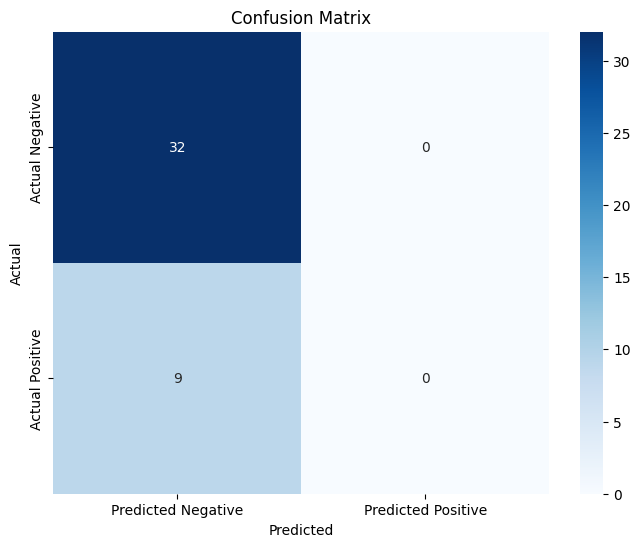

# Lab ML Ranking Assignment

**The Pointwise Approach -- Staged Logistic Regression**


## Slides
[https://carlosug.github.io/ML-Ranking/notebook_rank.slides.html#/](https://carlosug.github.io/ML-Ranking/notebook_rank.slides.html#/)

To make the slides, run in `dir`:
```bash
❯ jupyter nbconvert notebook_rank.ipynb --to slides --post serve --ServePostProcessor.port=8889
```


## Exercises in the assignment:

1. Choose a type of MLR approach
2. Understand how it works
3. (Independent subtask) Map a set of Real-world lab tests to LOINC
4. Given a list of documents for 3 queries (“glucose in blood”, “bilirubin in plasma”, “White blood cells count”), build the appropiate training set for the chosen approach
**Given a list of documents for 3 queries (“glucose in blood”, “bilirubin in plasma”, “White blood cells count”), build the appropiate training set for the chosen approach**

- **Original Dataset**: Loinc dataset-v2 ([Moodle Link](https://moodle.upm.es/titulaciones/oficiales/pluginfile.php/12154071/mod_resource/content/0/loinc_dataset-v2.xlsx)).
- **Consolidated dataset**: [loinc_dataset_all.csv](./loinc_dataset_all.csv). It is a consolidation of the three queries manually performed.
- **Annotated dataset**: [annotated_loinc_dataset.csv](annotated_loinc_dataset.csv). It programatically annotated LOINC code relevance rank
- **Training Dataset**: [encoded_training_dataset.csv](encoded_training_dataset.csv). It contains the encoded data with an additional `label` column for supervised learning tasks.
5. MLR algoritm implementation
- **Model Accuracy: 0.78**

| **Metric**       | **Precision** | **Recall** | **F1-Score** | **Support** |
|------------------|---------------|------------|--------------|-------------|
| 0                | 0.780488      | 1.000000   | 0.876712     | 32.000000   |
| 1                | 0.000000      | 0.000000   | 0.000000     | 9.000000    |
| Accuracy         | 0.780488      | 0.780488   | 0.780488     | 0.780488    |
| Macro avg        | 0.390244      | 0.500000   | 0.438356     | 41.000000   |
| Weighted avg     | 0.609161      | 0.780488   | 0.684263     | 41.000000   |




- Model outputs: [logistic_model.pkl](logistic_model.pkl) and [scaler.pkl](scaler.pkl)


---